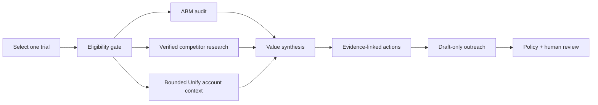

# GTMHack2 — First-Week ABM Rescue Brief

> In five minutes, turn one new ZenABM trial into an evidence-linked growth plan a human can trust.

GTMHack2 is an agentic GTM workflow for the moment after a company starts a ZenABM trial. Instead of making a seller manually dig through ads, competitors, and CRM notes, it creates a short first-week brief: what we know, what we do not know, three prioritized actions, and a reviewable outreach draft.

**It never auto-sends a message.** Permission, evidence quality, and human review are part of the product—not an afterthought.

## Judge quick start

Run the interactive demo with no API keys or installation:

```bash
python3 -m http.server 8000 --directory demo
```

Open [http://localhost:8000](http://localhost:8000), then:

1. Select **Northstar Analytics**.
2. Click **Run the 5-minute plan**.
3. Follow the agents from trial gate to policy review.
4. Click **Preview Unify handoff** in the finished brief.
5. Reset, choose **Harbor Studio**, and run it again to see the opt-out safety stop.

The deck for a live presentation is [demo/GTMHack2-Hackathon-Demo.pptx](demo/GTMHack2-Hackathon-Demo.pptx). The detailed presenter script is in [demo/README.md](demo/README.md).

## The problem

The first few days of a trial decide whether a customer sees value or quietly disengages. But a useful first conversation requires several time-consuming checks:

- Is this really an active trial, and may we contact the person?
- What does the trial account's LinkedIn ABM activity say?
- What can we responsibly learn from public competitor-ad activity?
- What is the one next action that makes ZenABM valuable now?

Most automation either produces generic advice or skips the permission and evidence checks. GTMHack2 is designed to do neither.

## What the product does



| Agent | Job | Guardrail |
| --- | --- | --- |
| Trial gatekeeper | Confirms the trial, company identity, and marketing permission. | Stops on inactive, suppressed, or opted-out records. |
| ABM analyst | Finds supported campaign, format, account-engagement, and deal-influence opportunities. | Missing data stays `unknown`. |
| Competitor researcher | Resolves canonical LinkedIn company IDs and reads public-ad signals. | A fuzzy company match is not evidence. |
| Unify enrichment | Adds only the smallest useful account brief or DataTable context. | No person discovery, List, sequence, enrollment, task, or send. |
| Value synthesizer | Produces up to three source-linked next actions. | Separates facts, interpretation, and recommendations. |
| Drafting + policy guard | Creates a reviewable email/LinkedIn draft and checks every claim. | Draft-only; a human approves anything customer-facing. |

## What judges can see in the demo

The demo uses sanitized fixtures so it is repeatable and safe to run on any laptop.

| Scenario | What it proves |
| --- | --- |
| **Northstar Analytics** | A permitted active trial receives an evidence-linked brief, three next steps, a safe Unify handoff preview, and a draft email. |
| **Harbor Studio** | An opt-out blocks enrichment, drafting, and any potential send. |
| **Juniper Cloud** | Missing public-ad evidence produces an honest stop—not a made-up competitor claim. |

For the recommended Northstar flow, the fixture supports only this claim: a canonically verified competitor has a public LinkedIn-ad observation. Public visibility is partial, so impressions, spend, clicks, creative, targeting, and causal impact are deliberately shown as unknown.

## Why this is different

1. **A real product moment:** it helps a customer get to value during the most important week of a trial.
2. **One orchestrator, focused specialists:** external GTM skills are bounded workers, not overlapping autonomous pipelines.
3. **Evidence is visible:** every recommendation points back to source IDs and coverage limits.
4. **Safety is demonstrable:** the demo proves both a successful brief and a safe refusal.
5. **Unify has a useful, narrow role:** account context improves the plan without turning the system into an unsupervised outbound sender.

## What is live today vs. production-ready

| Capability | Demo today | Production boundary |
| --- | --- | --- |
| Trial, competitor, and policy flow | Sanitized deterministic fixtures | Codespaces-only adapters for one explicitly selected trial |
| ZenABM ABM analysis | Fixture-backed and source-aware | Permitted ZenABM admin API data |
| Unify context | Interactive fixture preview | Server-side Unify account brief/DataTable request, using free or user-owned sources first |
| CRM output | Displayed as review-only output | HubSpot draft/note/task only after policy passes |
| Outreach | Draft copy only | Still human-approved; no automatic send path |

The current Codex workspace does not expose callable Unify MCP tools, so the demo labels its Unify handoff as fixture data. The production contract is documented in [agents/07-unify-enrichment.md](agents/07-unify-enrichment.md) and is intentionally server-side and no-send.

## Built from the original work

This repository builds on the original ZenABM trial-to-value baseline:

- [Project brief](docs/PROJECT_BRIEF.md) defines the first-week value promise.
- [Architecture](docs/ARCHITECTURE.md) defines evidence, identity, privacy, and review boundaries.
- [Agent definitions](agents/) define structured handoffs.
- [Contracts](contracts/) make source IDs, coverage, confidence, and draft-only behavior explicit.
- [Fixtures](fixtures/) make the workflow testable without credentials or customer data.
- [Imported context](context/) supplies the ZenABM ABM-audit and LinkedIn competitor-intelligence knowledge base.

GTMHack2 adds the interactive judge demo, presenter deck, and bounded Unify enrichment agent to make that original work easy to understand in a live hackathon presentation.

## Repository map

```text
demo/           Interactive fixture-backed product demo and presentation deck
agents/         Agent responsibilities and operating rules
contracts/      Shared schemas for safe, structured handoffs
fixtures/       Sanitized inputs and expected outcomes
src/            Fixture policy runner and future provider adapters
context/        Read-only ZenABM audit and competitor-intelligence source material
docs/           Product brief, architecture, delivery plan, and credential policy
tests/          Fixture and contract tests
```

## Engineering and safety notes

- Local development is fixture-only. Live calls belong in a Codespace with scoped, revocable hackathon credentials.
- Never commit credentials, raw provider responses, customer data, or generated customer reports.
- Verify a competitor's canonical LinkedIn company ID before using it as evidence.
- Missing public-ad data is not zero.
- Keep customer-facing output in draft state until a person approves it.

For implementation detail, start with [AGENTS.md](AGENTS.md), [docs/DELIVERY_PLAN.md](docs/DELIVERY_PLAN.md), and [demo/README.md](demo/README.md).
