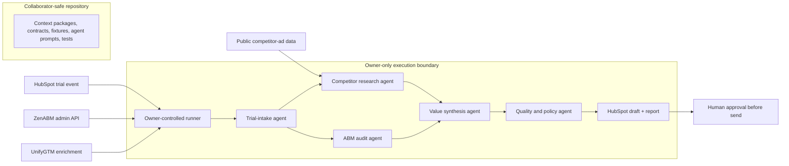

# Trial-to-value GTM workflow

## Outcome

For a new ZenABM trial, create a useful, evidence-backed growth brief before asking for a paid conversion. The brief combines the trial user's own ZenABM performance, public competitor advertising activity, and permitted HubSpot context. It ends in a reviewable email/LinkedIn-message draft and a concrete ZenABM next step.

The first version creates drafts only. It never auto-sends outreach.



## Agent responsibilities

| Agent | Input | Output | Non-negotiable rule |
| --- | --- | --- | --- |
| Trial intake | HubSpot trial event and product identity | Validated trial profile | Stop if the user is not an active trial or has opted out. |
| Account research | Company/domain and permitted UnifyGTM context | Account brief and candidate competitors | Keep third-party enrichment separate from user-owned performance data. |
| Competitor research | Verified LinkedIn company URLs/IDs | Public-ad landscape | Resolve a canonical company ID; fuzzy name matches are not evidence. |
| ABM audit | The trial user's ZenABM data | Performance gaps and opportunities | Missing data is unknown, never zero. |
| Value synthesis | Research and audit packets | 3 evidence-linked actions and a report | Do not invent spend, targeting segments, or causal claims. |
| Copy writer | Approved value brief and CRM tone/context | Email and LinkedIn-message drafts | Draft only; include a specific value claim and CTA. |
| Quality and policy | All proposed outputs | Pass/fail plus reasons | Reject unsupported claims, wrong-recipient data, opt-outs, and send attempts. |

## Provider boundary

Only the owner-controlled runner may call ZenABM, HubSpot, UnifyGTM, or an LLM API. Contributors work against checked-in fixtures and adapter interfaces. No provider credential exists in this repository or Codespaces; live execution runs from the owner's local environment or a separate private runner repository.

Use the smallest possible data footprint: retrieve only the trial account and contacts required for that run, store a run ID and report artifact rather than raw provider responses, and log sources/limits for every claim.

## Source constraints that shape the workflow

- LinkedIn advertiser search is fuzzy; verify a canonical company ID before analysis.
- Filter date, country, and ad type client-side. Do not send unsupported API parameters.
- Public-ad impression/targeting coverage can be absent outside EU/EEA visibility. Treat those values as unknown.
- The public API does not expose spend, ad creative, clicks, or hidden targeting segments. Never infer them as facts.
- Respect the observed burst rate and daily request budget. Queue competitor lookups rather than fan them out unbounded.

## Repository layout

```text
context/       Reusable, credential-free source from the existing ZenABM projects
docs/          Architecture, delivery plan, credential boundary, decisions
agents/        Agent prompts and output rules (next implementation slice)
contracts/     Input/output schemas shared by agents (next implementation slice)
fixtures/      Sanitized provider responses for local development (next implementation slice)
src/           Owner-executed workflow and provider adapters (next implementation slice)
.github/       Manual, approval-gated live runner (after fixture workflow passes)
```

## Operating guardrails

- Run on an explicit `trial_started` event or a manually selected trial; never bulk-enrich every contact.
- Create a HubSpot note/task and message draft first. A person reviews the claims and chooses whether to send.
- Preserve a suppression/opt-out check before draft creation and again before sending.
- Confirm ZenABM's product terms, privacy notice, and customer permissions allow the intended admin processing before enabling live runs.
- Electronic marketing and personal-data processing have jurisdiction-specific obligations. Treat emails and LinkedIn messages as marketing drafts until your compliance owner approves the sending rules.
